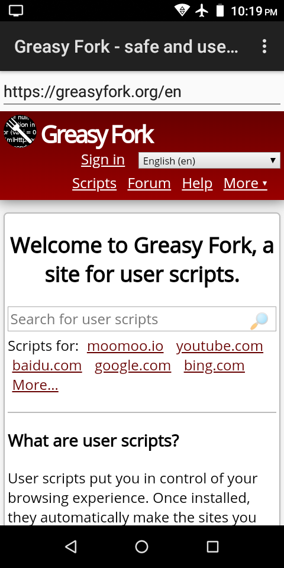
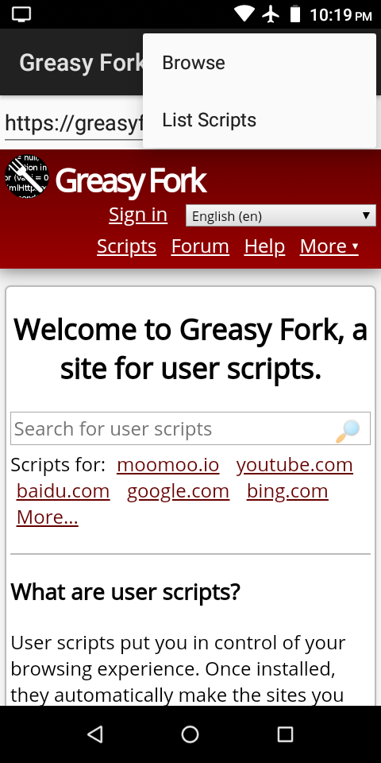
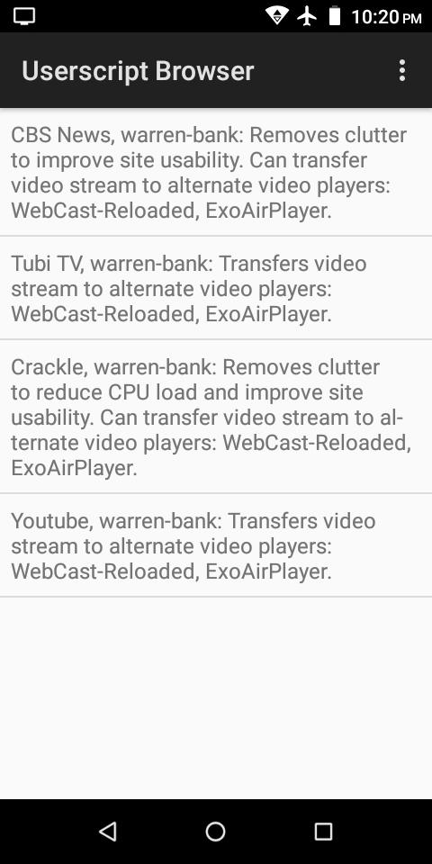

#### [Android libraries](https://github.com/warren-bank/Android-libraries/tree/wbayer/webview-gm)

__original application:__

* source code repo: [WebView-GM](https://github.com/wbayer/webview-gm)
* author/copyright: [Werner Bayer](https://github.com/wbayer)
* license: [Apache 2.0](https://github.com/wbayer/webview-gm/blob/86ddc6a91b220157543d9ca631adb5e5f45e0bb9/LICENSE)
* forked from commit SHA: [86ddc6a](https://github.com/wbayer/webview-gm/tree/86ddc6a91b220157543d9ca631adb5e5f45e0bb9)
  * date of commit: Mar 3, 2016

__screenshot:__

__notes:__

* what it does:
  * adds Greasemonkey-compatible user script support to standard `WebView`
* what I like:
  * extremely light-weight
  * easy to compile
  * easy to customize
  * demo app works surprisingly well
* what I dislike:
  * not a thing

__changes:__

* replaced Gradle build scripts
* removed:
  - unnecessary Gradle plugins
    * [com.github.dcendents:android-maven-gradle-plugin](https://github.com/dcendents/android-maven-gradle-plugin)
    * [com.jfrog.bintray.gradle:gradle-bintray-plugin](https://github.com/bintray/gradle-bintray-plugin)
