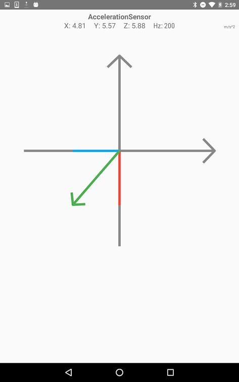

#### [Android libraries](https://github.com/warren-bank/Android-libraries/tree/KalebKE/AccelerationExplorer)

__original application:__

* source code repo: [Acceleration Explorer](https://github.com/KalebKE/AccelerationExplorer)
* author/copyright: [KalebKE](https://github.com/KalebKE)
* license: [Apache 2.0](https://github.com/KalebKE/AccelerationExplorer/blob/441335b1339e7e81f2f06e6924f1a6dbd2fc36a5/license)
* forked from commit SHA: [441335b](https://github.com/KalebKE/AccelerationExplorer/tree/441335b1339e7e81f2f06e6924f1a6dbd2fc36a5)
  * tag: `v3.3.1`
  * date of commit: Apr 13, 2019

__screenshot:__

__notes:__

* what it does:
  * allows experimentation with the acceleration sensor
  * applies smoothing and low-pass filters
