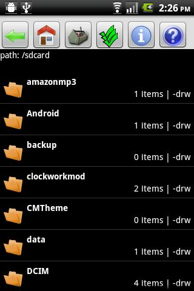
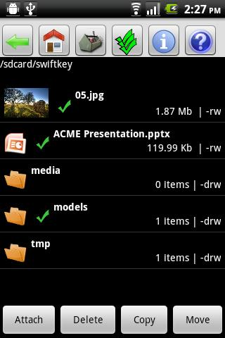

#### [Android libraries](https://github.com/warren-bank/Android-libraries/tree/fork/nexes/Android-File-Manager/01_read_only)

__original application:__

* source code repo: [Android-File-Manager](https://github.com/nexes/Android-File-Manager)
* author/copyright: [Joe Berria](mailto:joeberria@gmail.com)
* license: [GNU GPL 3.0](http://www.gnu.org/licenses/gpl-3.0.txt)
* forked from commit SHA: [51fece5](https://github.com/nexes/Android-File-Manager/tree/51fece59766d36c77f54cc3cef81dafe7f10f3f6)
  * date of commit: Feb 1, 2012

__screenshot:__

__notes:__

* what it does:
  * file system manager
* what I like:
  * the APK is tiny (328 KB)
  * supports Android 1.6+
    * personally tested on Android 4.4 KitKat
      * works perfectly
  * packs __a lot__ of functionality and features
    * could easily be stripped down and used as the basis for a customized file system browser Activity
* what I dislike:
  * for what it is:
    * absolutely nothing
      * my only minor criticism would be that _alphabetic_ sort order mixes directories and files into a single sorted list
  * for what it is not:
    * the UI could use an update to _Material Design_

__changes:__

* added Gradle build scripts

__fork:__

* strip functionality to a bare-bones directory browser
* allow the "home" directory to be specified in an Intent
  * example configuration to open a specific "home" directory from a homescreen shortcut using [AnyCut](https://github.com/warren-bank/Android-libraries/tree/nujham/AnyCut):
    * _Make your own shortcut:_
      * __Action:__ `com.nexes.manager.Main.ACTION_WIDGET`
      * __Data:__ `file:/sdcard/Download`
      * __Type:__ _[empty]_
* fix _Alphabetic_ sorting to display directories before files
* fix the way the "home" directory is initialized
  * now: the "back stack" contains all of its parent directories, eventually leading back to "/"
  * previously: the "back stack" only contained "/"
