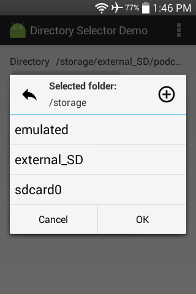
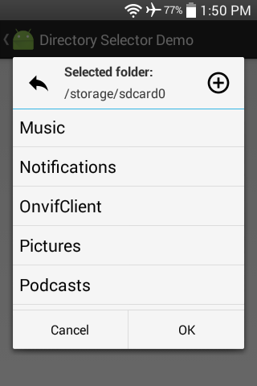

#### [Android libraries](https://github.com/warren-bank/Android-libraries/tree/lemberg/directory-selector-dialog-preference)

__original library:__

* source code repo: [Directory Selector Dialog Preference](https://github.com/lemberg/directory-selector-dialog-preference)
* author/copyright: [Lemberg Solutions](https://lembergsolutions.com/)
* license: [MIT](https://github.com/lemberg/directory-selector-dialog-preference/blob/96bc75188351d5ea8aacbf9d87dfb56066e4a73a/LICENSE)
* forked from commit SHA: [96bc751](https://github.com/lemberg/directory-selector-dialog-preference/tree/96bc75188351d5ea8aacbf9d87dfb56066e4a73a)
  * date of commit: Feb 12, 2015

__screenshot:__

__notes:__

* what it does:
  * Directory chooser dialog that is easily wired into a `PreferenceFragment` through xml
    * displays a list of file system directories
    * can navigate up or down the tree
    * can create new subdirectories
    * can "cancel"
      * closes dialog
      * value of `Preference` is not changed
    * can "confirm" the selection of the current directory
      * closes dialog
      * value of `Preference` is updated and saved
* what I like:
  * _brilliant_
    * provides a simple solution to a very real (and very common) need
  * quality of coding is excellent
  * a clean/minimal/utilitarian UI
* what I dislike:
  * absolutely nothing.. great library

__changes:__

* replaced Gradle build scripts
* removed all unit tests
