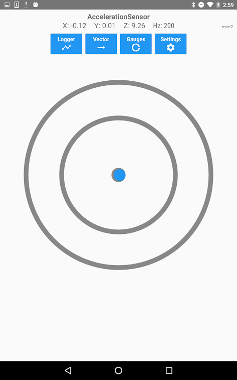

#### [Android libraries](https://github.com/warren-bank/Android-libraries/tree/twitwi/AndroidDnssdDemo)

__original application:__

* source code repo: [AndroidDnssdDemo](https://github.com/twitwi/AndroidDnssdDemo)
* author/copyright: [Rémi Emonet](https://github.com/twitwi)
* license: _none specified_
* forked from commit SHA: [2756ff8](https://github.com/twitwi/AndroidDnssdDemo/tree/2756ff8d8e5ecb9cae0be33724050719049dfd10)
  * date of commit: Sep 5, 2012

__screenshot:__

__notes:__

* what it does:
  * demonstrates usage of [JmDNS](https://github.com/jmdns/jmdns)
  * registers a custom type of _Bonjour_ service on the LAN
  * listens for the same type of _Bonjour_ services on the LAN
    * displays their comings and goings
* what I like:
  * it works!
  * being an absolutely barebones app, it helped me to debug a much more complicated app that is using the same [JmDNS](https://github.com/jmdns/jmdns) library

__changes:__

* added Gradle build scripts
* removed unnecessary files
* reorganized the files kept
  - renamed the package
* removed unnecessary UI elements
* changes string values that were originally _cute_
* formatted the output for readability
* moved network server to a non-UI Thread
