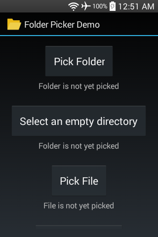
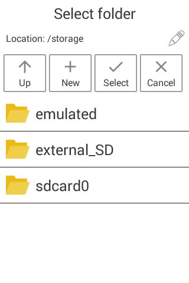
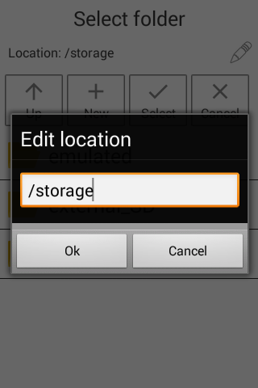
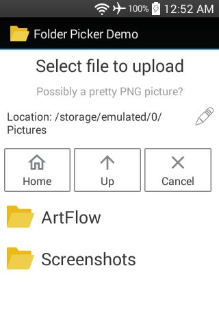
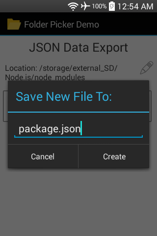
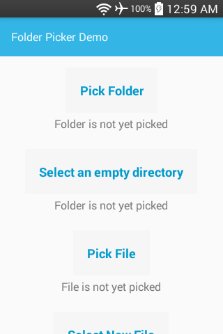
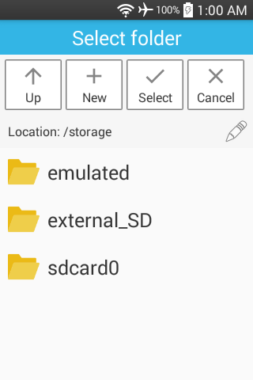
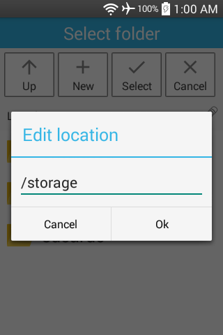
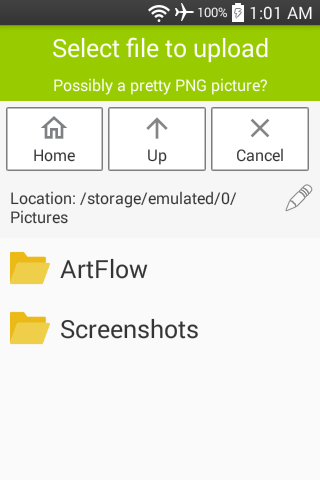
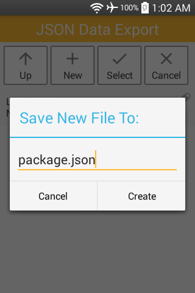

#### [Android libraries](https://github.com/warren-bank/Android-libraries/tree/fork/kashifo/android-folder-picker-library/material-design)

__original application:__

* source code repo: [android-folder-picker-library](https://github.com/kashifo/android-folder-picker-library)
* author/copyright: [Kashif Anwaar](https://github.com/kashifo)
* contributors:
  * [gee12](https://github.com/gee12/android-folder-picker-library)
  * [warren-bank](https://github.com/warren-bank/Android-libraries/tree/fork/kashifo/android-folder-picker-library/PR13-gee12)
  * [warren-bank](https://github.com/warren-bank/Android-libraries/tree/fork/kashifo/android-folder-picker-library/material-design)
* license: [Apache 2.0](https://github.com/kashifo/android-folder-picker-library/blob/f9d1ea948ca63333540432d7fcf5276b071994df/LICENSE)
* forked from commit SHA: [f9d1ea9](https://github.com/kashifo/android-folder-picker-library/tree/f9d1ea948ca63333540432d7fcf5276b071994df)
  * date of commit: May 23, 2018
  * tag: v2.4

__screenshots / _folderpicker-sample_:__







__screenshots / _folderpicker-support-sample_:__







__notes:__

* what it does:
  * Activity that can be opened for a result
    * starting Intent can configure some features and behavior
      * constructed using a Builder class, which greatly simplifies usage of the library
    * displays a list of file system directories and files
    * can navigate up or down the tree
    * can manually "edit" the current directory path
    * can "cancel"
      * closes Activity
      * returns a result that indicates no selection was made
    * when choosing a directory:
      * can create a "new" subdirectory in the current directory
      * can "select" the current directory
        * closes Activity
        * returns a result that includes the selected directory
    * when choosing a file:
      * can click on a file in the current directory
        * can validate filenames with a regex pattern
        * if the filename is acceptable
          * closes Activity
          * returns a result that includes the selected file
    * when choosing a new file:
      * can choose a directory
      * after the current directory has been selected
        * can enter the new filename into a dialog
          * can validate filenames with a regex pattern
          * if the filename is acceptable
            * closes Activity
            * returns a result that includes the absolute file path for the new file
* what I like:
  * size of the library is incredibly compact
  * comes in 2x variations:
    1. uses no dependencies
       * minSDK = 9
    2. uses androidx support libraries
       * minSDK = 16
  * quality of coding is excellent
  * the UI:
    * minimal (in a good way)
      * contains only what is needed for the desired functionality, and no more
* what I dislike:
  * absolutely nothing.. great library

__builder:__

import one of the 2x library variations:

* no dependencies:
  ```java
    import lib.folderpicker.FolderPicker;
  ```
* androidx:
  ```java
    import lib.folderpicker.support.FolderPicker;
  ```

use the Builder class to configure and start _FolderPicker_:

```java
FolderPicker.withBuilder()
  .withTheme(int_themeResId)
  .withTitle(str_title_line1)
  .withDescription(str_description_line2)
  .withPath(str_dirpath)
  .withHomeButton(bool_show)
  .withEmptyFolder(bool_only_accept_dir_with_no_contents)
  .withNewFilePrompt(str_ask_for_new_filename_after_directory_is_chosen)
  .withFilePicker(bool_show_files_and_accept_by_click)
  .withFileFilter(str_regex_pattern_to_validate_acceptable_filename_is_chosen)
  .withContext(context)
      // used to construct the Intent;
      // only required when no Activity is provided.
      // ie: using builder to return the Intent, rather than to start it immediately
  .withActivity(activity)
      // used to start the Intent;
      // also used as a Context to construct the Intent (unless another Context is provided)
  .withRequestCode(int_request_code)
      // used to start the Intent (for a result)
  .getIntent()
      // 1 of 2 possible ways to end the builder chain of commands:
      //   returns the constructed Intent
  .start()
      // 1 of 2 possible ways to end the builder chain of commands:
      //   returns a boolean to indicate success
      //   ie: all the information required was provided;
      //       an Intent was constructed and started for a result
;
```

__changes:__

* added Gradle build scripts
* updated demo app:
  * removed support library
  * lowered minSDK to match the library
* a _lot_ of bug fixes, new features, and general improvements to the library
  * [GPL 2.0](https://github.com/warren-bank/Android-libraries/blob/fork/kashifo/android-folder-picker-library/material-design/LICENSE.txt) license applies to all contributions
