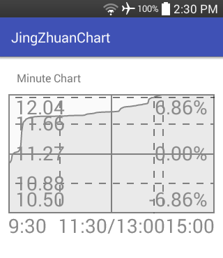
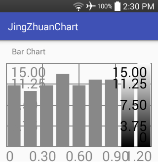
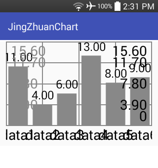
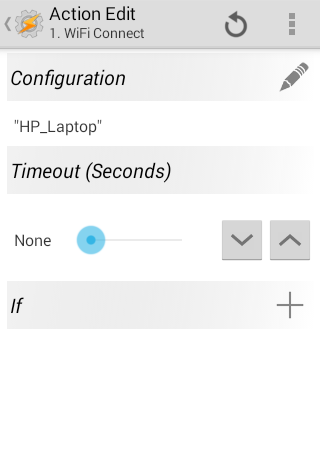
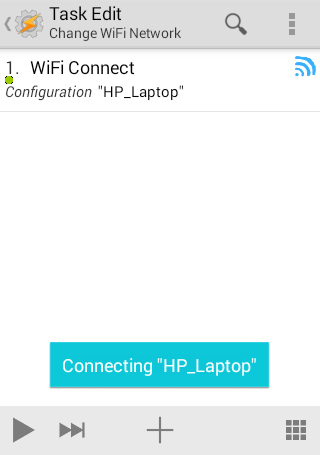
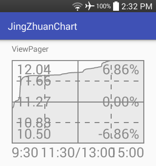
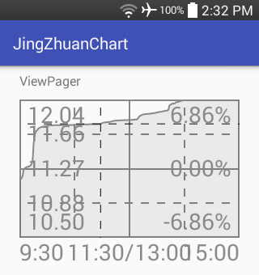
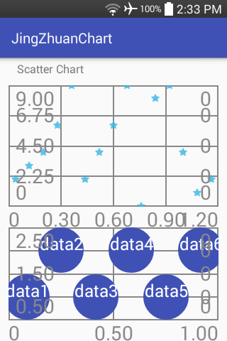

#### [Android libraries](https://github.com/warren-bank/Android-libraries/tree/JingZhuanDuoYing/JZAndroidChart)

__original application:__

* source code repo: [JingZhuan Android Chart](https://github.com/JingZhuanDuoYing/JZAndroidChart)
* author/copyright: [JingZhuanDuoYing](https://github.com/JingZhuanDuoYing)
* license: [Apache 2.0](https://github.com/JingZhuanDuoYing/JZAndroidChart/blob/9b532bb9f3454516816b1dee3d52669bd03501ca/LICENSE)
* forked from commit SHA: [9b532bb](https://github.com/JingZhuanDuoYing/JZAndroidChart/tree/9b532bb9f3454516816b1dee3d52669bd03501ca)
  * date of commit: Aug 27, 2019

__screenshot:__

__notes:__

* what it does:
  * two distinct libraries
    - each provides components to display raw data in various types of graphical charts
* what I like:
  * light-weight
  * easy to use
  * includes several types of charts
  * works pretty well
* what I dislike:
  * axis labels are too large on small screens
  * needs a little more polish

__changes:__

* replaced Gradle build scripts
* reorganized directories
* removed:
  - unit tests
  - unnecessary Gradle plugins
    * [com.github.dcendents:android-maven-gradle-plugin](https://github.com/dcendents/android-maven-gradle-plugin)
    * [com.novoda:bintray-release](https://github.com/novoda/bintray-release)
    * [com.bmuschko:gradle-nexus-plugin](https://github.com/bmuschko/gradle-nexus-plugin)
    * [org.jetbrains.kotlin:kotlin-gradle-plugin](https://kotlinlang.org/docs/reference/using-gradle.html)
* converted from Kotlin to Java:
  - `BarChartModel.kt` in both sample apps
