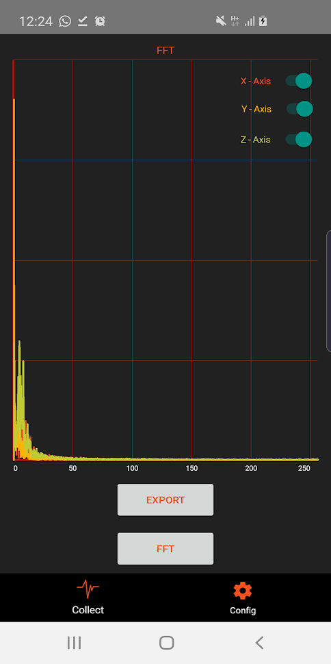
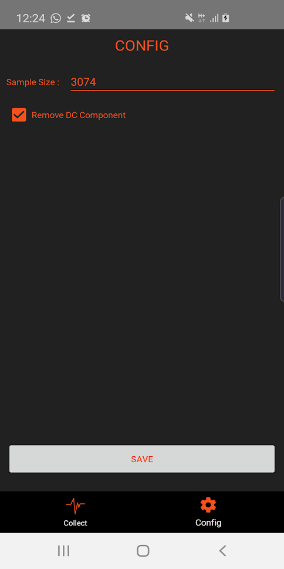

#### [Android libraries](https://github.com/warren-bank/Android-libraries/tree/dinceruur/androidFFT)

__original application:__

* source code repo: [FFT (_Fast Fourier Transform_) Android Acceleration Data](https://github.com/dinceruur/androidFFT)
* author/copyright: [Uğur Dinçer](https://github.com/dinceruur)
* license: _none specified_
* forked from commit SHA: [0090c5d](https://github.com/dinceruur/androidFFT/tree/0090c5d0e43ac71d6710de7bb5c740d588d0f506)
  * date of commit: Sep 11, 2019

__screenshot:__

__notes:__

* what it does:
  * collect raw real-time acceleration sensor data
    * option to export
    * ability to pass through FFT and display line chart of frequency domain
* what I like:
  * light-weight
  * fast and efficient
    * uses [native code FFT library](https://github.com/berndporr/kiss-fft)
  * looks great
  * can configure the quantity (sample size) of raw real-time acceleration sensor data to collect
* what I dislike:
  * _absolutely nothing_

__changes:__

* replaced Gradle build scripts
* reorganized directories

__issues:__

* tested on: `armeabi-v7a`
  - when the "FFT" button is clicked, the native code executes
    * the app immediately crashes with the error: `libc: Fatal signal 11 (SIGSEGV)`
