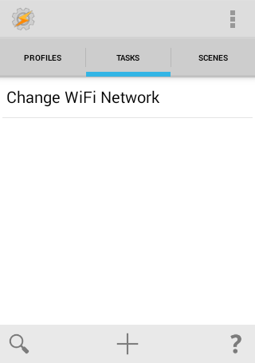
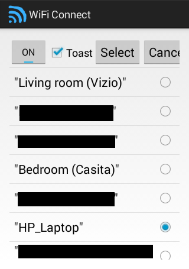

#### [Android libraries](https://github.com/warren-bank/Android-libraries/tree/hashiz/wificonnect)

__original application:__

* source code repo: [WiFi Connect for tasker](https://github.com/hashiz/wificonnect)
* distribution channel: [Google Play](https://play.google.com/store/apps/details?id=jp.meridiani.apps.wificonnect)
* author/copyright: [HASHI Hiroaki](https://github.com/hashiz)
* license: _none specified_
* forked from commit SHA: [5bf62e9](https://github.com/hashiz/wificonnect/tree/5bf62e908d1f99caa6fa285278ad3f78d79738c9)
  * date of commit: May 5, 2016

__screenshot:__

__notes:__

* what it does:
  * [Tasker](https://play.google.com/store/apps/details?id=net.dinglisch.android.taskerm) plugin
* what I like:
  * coding is minimal and well organized
  * makes it easy to understand how Tasker [plugins](https://tasker.joaoapps.com/plugins.html) work

__changes:__

* replaced Gradle build scripts
* removed:
  - unnecessary dependencies
    * [Android Support Library v4](https://mvnrepository.com/artifact/com.android.support/support-v4/18.0.0)
